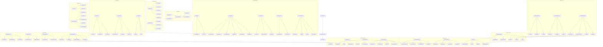

```mermaid

flowchart TD
    Splash[Splash Screen] --> Onboarding[Onboarding Screens]
    Onboarding --> Home[Home Screen]
    
    subgraph Authentication[Auth System]
        Login[Login Screen]
        Register[Registration]
        OTP[OTP Verification]
        ForgotPass[Forgot Password]
        ResetPass[Reset Password]
        
        Register --> OTP
        ForgotPass --> OTP
        OTP --> ResetPass
    end
    
    subgraph TopBar[Top Navigation]
        Location[Location Selector]
        Location --> AddressBook[Address Book]
        Location --> AddAddress[Add New Address]
        Location --> MapPicker[Map Selection]
        
        Country[Country/Region]
        Country --> LanguageSelect[Language Selection]
        Country --> RegionSettings[Regional Settings]
        
        Currency[Currency Settings]
        Currency --> ExchangeRates[Exchange Rates]
        Currency --> AutoConvert[Auto-Convert Prices]
        
        Notifications[Notifications]
        Notifications --> OrderUpdates[Order Updates]
        Notifications --> Promos[Promotional]
        Notifications --> SystemNotif[System Notifications]
        Notifications --> Settings[Notification Settings]
    end
    
    subgraph Account[Account Section]
        Profile[Profile Management]
        Profile --> PersonalInfo[Personal Information]
        Profile --> SecuritySettings[Security Settings]
        Profile --> LinkedAccounts[Linked Accounts]
        Profile --> Preferences[Preferences]
        
        Orders[Orders & Returns]
        Orders --> ActiveOrders[Active Orders]
        Orders --> OrderHistory[Order History]
        Orders --> Returns[Return Requests]
        Orders --> Cancellations[Cancellations]
        
        Wallet[Digital Wallet]
        Wallet --> Balance[Balance & History]
        Wallet --> TopUp[Top Up]
        Wallet --> Withdraw[Withdraw]
        Wallet --> Cards[Saved Cards]
    end
    
    subgraph Search[Search System]
        SearchBar[Search Bar]
        SearchBar --> TextSearch[Text Search]
        SearchBar --> VoiceSearch[Voice Search]
        SearchBar --> QRScanner[QR Scanner]
        SearchBar --> ImageSearch[Image Search]
        
        SearchResults[Search Results]
        SearchResults --> Filters[Filter Options]
        SearchResults --> Sort[Sort Options]
        SearchResults --> CategoryFilter[Category Filter]
        SearchResults --> PriceFilter[Price Range]
    end
    
    subgraph Shopping[Shopping Features]
        Categories[Categories]
        Categories --> SubCategories[Sub Categories]
        Categories --> BrowseAll[Browse All]
        
        ProductDetail[Product Detail]
        ProductDetail --> Images[Product Images]
        ProductDetail --> Videos[Product Videos]
        ProductDetail --> Reviews[Reviews & Ratings]
        ProductDetail --> Questions[Q&A Section]
        ProductDetail --> Similar[Similar Products]
        ProductDetail --> Specs[Specifications]
        
        Customization[Customization]
        Customization --> Designer[Design Tool]
        Customization --> Templates[Design Templates]
        Customization --> Preview[3D Preview]
        
        Protection[Protection Plans]
        Protection --> Coverage[Coverage Options]
        Protection --> Claims[Claims Process]
        
        Finance[Financial Services]
        Finance --> HirePurchase[Hire Purchase]
        Finance --> Leasing[Leasing]
        Finance --> Rental[Rental]
        Finance --> Calculator[EMI Calculator]
    end
    
    subgraph Social[Social Features]
        Feed[Social Feed]
        Feed --> UserPosts[User Posts]
        Feed --> ProductPosts[Product Posts]
        Feed --> LiveStreams[Live Streams]
        
        Chat[Chat System]
        Chat --> CustomerService[Customer Service]
        Chat --> SellerChat[Seller Chat]
        Chat --> GroupChat[Group Chat]
        
        Community[Community]
        Community --> Forums[Forums]
        Community --> Reviews[Product Reviews]
        Community --> QandA[Q&A]
    end
    
    subgraph Reseller[Reseller Portal]
        Dashboard[Reseller Dashboard]
        Dashboard --> Analytics[Analytics]
        Dashboard --> Performance[Performance]
        Dashboard --> Earnings[Earnings]
        
        Products[Product Management]
        Products --> AddProduct[Add Product]
        Products --> EditProduct[Edit Product]
        Products --> Inventory[Inventory]
        
        ResellerOrders[Order Management]
        ResellerOrders --> Pending[Pending Orders]
        ResellerOrders --> Processing[Processing]
        ResellerOrders --> Shipping[Shipping]
        ResellerOrders --> Completed[Completed]
    end
    
    subgraph Cart[Shopping Cart]
        CartView[Cart View]
        CartView --> EditQuantity[Edit Quantity]
        CartView --> SaveLater[Save for Later]
        CartView --> ApplyCoupon[Apply Coupon]
        
        Checkout[Checkout Process]
        Checkout --> DeliveryInfo[Delivery Info]
        Checkout --> PaymentSelect[Payment Selection]
        Checkout --> Review[Order Review]
        Checkout --> Confirmation[Order Confirmation]
    end
    
    subgraph Payment[Payment System]
        Methods[Payment Methods]
        Methods --> Cards[Credit/Debit Cards]
        Methods --> Wallet[E-Wallet]
        Methods --> Banking[Online Banking]
        Methods --> COD[Cash on Delivery]
        
        Processing[Payment Processing]
        Processing --> Verification[3D Secure]
        Processing --> Success[Success]
        Processing --> Failed[Failed]
    end
    
    subgraph More[Additional Features]
        Settings[App Settings]
        Settings --> Appearance[Appearance]
        Settings --> Privacy[Privacy]
        Settings --> Notifications[Push Notifications]
        
        Support[Help & Support]
        Support --> FAQ[FAQs]
        Support --> Tickets[Support Tickets]
        Support --> LiveChat[Live Chat]
        
        Legal[Legal Information]
        Legal --> Terms[Terms of Service]
        Legal --> Privacy[Privacy Policy]
        Legal --> Returns[Return Policy]
        
        Rewards[Rewards Program]
        Rewards --> Points[Points System]
        Rewards --> Missions[Daily Missions]
        Rewards --> Vouchers[Vouchers]
        Rewards --> Membership[Membership Tiers]
    end
```
