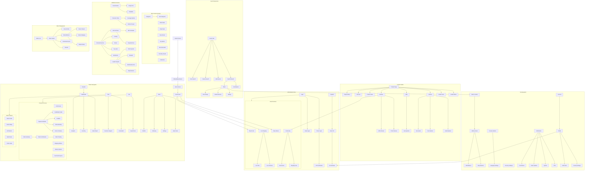

```mermaid

flowchart TD
    Splash[Splash Screen] --> Onboarding[Onboarding Screens]
    Onboarding --> Home[Home Screen]
    
    subgraph Authentication[Authentication Flow]
        Login[Login] --> Phone[Phone Login]
        Login --> Email[Email Login]
        Login --> Social[Social Login]
        Phone --> OTP[OTP Verification]
        Register[Register] --> UserInfo[Basic Info]
        UserInfo --> Verification[ID Verification]
    end
    
    subgraph TopBar[Top Navigation]
        Location[Location Selector] --> AddressBook[Address Book]
        AddressBook --> AddAddress[Add Address]
        AddressBook --> MapPicker[Map Selection]
        
        Country[Country Selector] --> Language[Language Settings]
        Currency[Currency Settings]
        
        Notif[Notifications] --> PromoNotif[Promotional]
        Notif --> OrderNotif[Order Updates]
        Notif --> SystemNotif[System]
        Notif --> ChatNotif[Chat]
        
        Account[Account] --> Profile[Profile]
        Profile --> EditProfile[Edit Profile]
        Profile --> Security[Security Settings]
        Profile --> Verification
    end
    
    subgraph Search[Search Experience]
        SearchBar[Search Bar] --> Voice[Voice Search]
        SearchBar --> Camera[Camera Search]
        SearchBar --> ScanQR[QR Scanner]
        SearchBar --> Results[Search Results]
        Results --> Filter[Filters]
        Results --> Sort[Sort Options]
        Filter --> PriceRange[Price Range]
        Filter --> Brands[Brands]
        Filter --> Ratings[Ratings]
        Filter --> Location[Seller Location]
    end
    
    subgraph MainContent[Main Content Sections]
        Categories[Categories] --> SubCategories[Sub Categories]
        FlashDeals[Flash Deals]
        DailyDeals[Daily Deals]
        NewArrivals[New Arrivals]
        TopSellers[Top Sellers]
        Recommended[Recommended]
        RecentlyViewed[Recently Viewed]
        Collections[Collections]
        Brands[Brand Directory]
    end
    
    subgraph ProductDetail[Product Details]
        Product[Product Page] --> Images[Image Gallery]
        Product --> AR[AR View]
        Product --> Video[Product Video]
        Product --> Variants[Variants]
        Product --> Reviews[Reviews]
        Product --> Questions[Q&A]
        Product --> Similar[Similar Items]
        Product --> Bundle[Bundle Offers]
        
        Reviews --> WriteReview[Write Review]
        Reviews --> PhotoReviews[Photo Reviews]
        Questions --> AskQuestion[Ask Question]
        
        Variants --> Size[Size Guide]
        Variants --> Color[Color Options]
        Variants --> Model[Model Options]
    end
    
    subgraph Services[Additional Services]
        Customize[Customization] --> Designer[Design Tool]
        Customize --> Templates[Templates]
        
        Protection[Protection Plans] --> Coverage[Coverage Options]
        Protection --> Claims[Claims Process]
        
        Finance[Financial Services] --> HirePurchase[Hire Purchase]
        Finance --> Leasing[Leasing]
        Finance --> Rental[Rental]
        Finance --> PayLater[Pay Later]
        Finance --> Installments[Installments]
        
        HirePurchase --> EMICalc[EMI Calculator]
        HirePurchase --> Documents[Required Docs]
        
        Loyalty[Loyalty Program] --> Points[Points System]
        Loyalty --> Rewards[Rewards]
        Loyalty --> Tiers[Membership Tiers]
        Loyalty --> Missions[Daily Missions]
    end
    
    subgraph BottomNav[Bottom Navigation]
        Home --> Feed[Personalized Feed]
        
        Reseller[Reseller] --> ResellerDash[Dashboard]
        ResellerDash --> Analytics[Analytics]
        ResellerDash --> Inventory[Inventory]
        ResellerDash --> Sales[Sales Report]
        
        Chat[Chat] --> Support[Customer Support]
        Chat --> Seller[Seller Chat]
        Chat --> Chatbot[AI Assistant]
        
        Cart[Cart] --> SavedItems[Saved Items]
        Cart --> Checkout[Checkout]
        
        More[More] --> Wishlist[Wishlist]
        More --> Following[Following]
        More --> Settings[Settings]
        More --> Help[Help Center]
    end
    
    subgraph Checkout[Checkout Process]
        CartReview[Cart Review]
        ShippingAddress[Shipping Address]
        DeliveryOptions[Delivery Options]
        Vouchers[Vouchers/Coupons]
        PaymentMethods[Payment Methods]
        OrderSummary[Order Summary]
        
        PaymentMethods --> Cards[Credit/Debit Cards]
        PaymentMethods --> Wallet[E-Wallet]
        PaymentMethods --> Banking[Online Banking]
        PaymentMethods --> COD[Cash on Delivery]
        
        OrderSummary --> Confirmation[Order Confirmation]
        Confirmation --> Tracking[Order Tracking]
    end
    
    subgraph Orders[Order Management]
        OrderList[Orders List] --> OrderDetails[Order Details]
        OrderDetails --> Cancel[Cancel Order]
        OrderDetails --> Return[Return/Refund]
        OrderDetails --> Invoice[Download Invoice]
        OrderDetails --> Reorder[Reorder]
        
        Return --> ReturnReason[Return Reason]
        Return --> ReturnShipping[Return Shipping]
        Return --> RefundStatus[Refund Status]
    end
    
    subgraph Social[Social Features]
        Feed[Social Feed] --> Posts[Shop Posts]
        Feed --> Lives[Live Shopping]
        Feed --> Stories[Shop Stories]
        
        Lives --> LiveChat[Live Chat]
        Lives --> LivePurchase[Live Purchase]
        
        Reviews --> Community[Community]
        Community --> Discussion[Discussions]
        Community --> Tips[Shopping Tips]
    end
    
    subgraph Seller[Seller Features]
        SellerProfile[Seller Profile]
        SellerRating[Seller Rating]
        SellerProducts[All Products]
        SellerDeals[Seller Deals]
        Follow[Follow Seller]
    end
```
